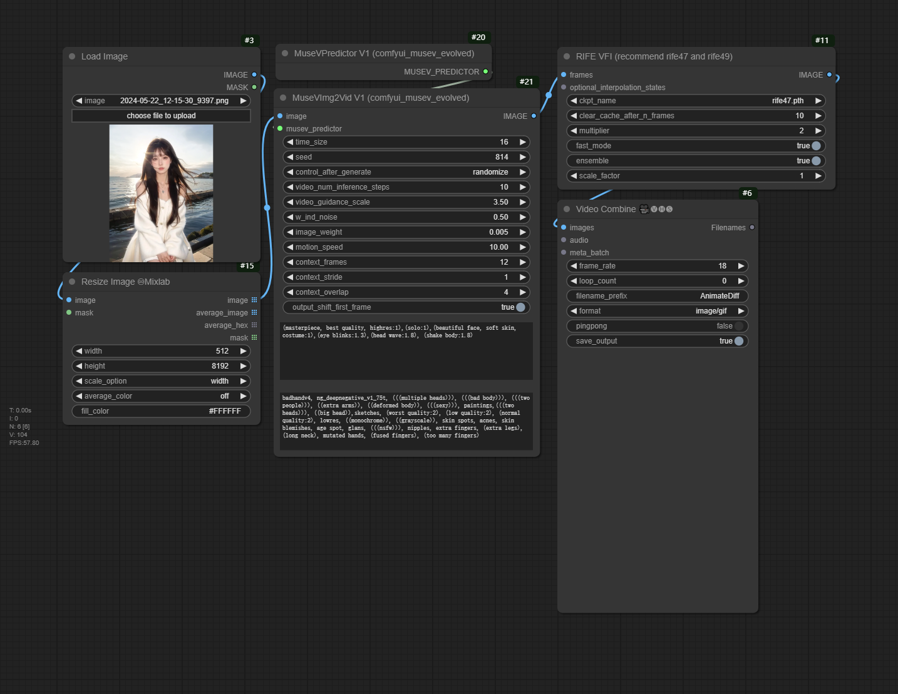

# ComfyUI MuseV Evolved

Based on the diffusion model, let us Anymate anything.

> This is the ComfyUI version of [MuseV](https://github.com/TMElyralab/MuseV), which also draws inspiration from [ComfyUI-MuseV](https://github.com/chaojie/ComfyUI-MuseV). It offers more configurable parameters, making it more flexible in implementation.

 

|  Input   | Output  | 
|  ----  | ----  | 
|  |  | 
|  |  | 
|  |  | 

## Example Workflow

|  Input   | Output  | Workflow Preview | Workflow |
|  ----  | ----  | ---- | ---- |
|  |  |  | [workflow](./docs/assets/example01_workflow.json) |


## Prepare Models

download https://huggingface.co/TMElyralab/MuseV to ComfyUI/models/diffusers

```
huggingface-cli download --resume-download TMElyralab/MuseV --local-dir ComfyUI/models/diffusers/TMElyralab/MuseV
```

## Contribution

Thank you for considering to help out with the source code! Welcome contributions from anyone on the internet, and are grateful for even the smallest of fixes!

If you'd like to contribute to this project, please fork, fix, commit and send a pull request for me to review and merge into the main code base.